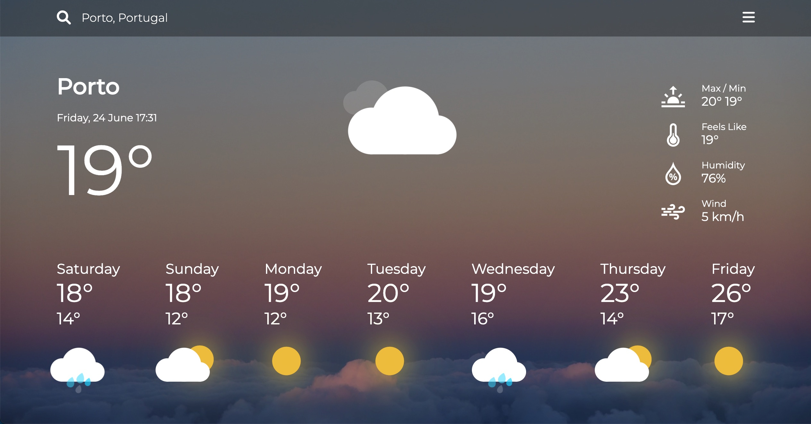

# Oding Project - Weather Dashboard

This project is part of the Odin Project JavaScript course: [https://www.theodinproject.com/](https://www.theodinproject.com/).

## Table of contents

- [Overview](#overview)
  <!-- - [The challenge](#the-challenge)
  - [Screenshot](#screenshot) -->
  <!-- - [Links](#links) -->
- [My process](#my-process)
  <!-- - [Built with](#built-with) -->
  <!-- - [What I learned](#what-i-learned)
  - [Continued development](#continued-development)
  - [Useful resources](#useful-resources) -->
- [Author](#author)
<!-- - [Acknowledgments](#acknowledgments) -->

## Overview

### The challenge

- Search for a location and view the current weather and forecast for the next 7 days
- View the optimal layout for the site depending on their device's screen size
- Perform new searches, the page will update automatically using JS language
- 
- Filter job listings based on the categories

### Screenshot

### Links

- Solution URL: [https://github.com/rfzamith/fm-static-job-listings/](https://github.com/rfzamith/fm-static-job-listings/)
- Live Site URL: [https://rfzamith.github.io/odin-weather-app/](https://rfzamith.github.io/odin-weather-app/)

## My process

### Built with

- HTML: Semantic Elements, Data Attributes
- CSS: Flexbox, Animation Keyframes
- JavaScript
<!-- 
### What I learned

Great opportunity to continue to expand my knowledge of CSS, JavaScript and DOM manipulation. This was a very enjoyable project, very challenging 

### Continued development

Use this section to outline areas that you want to continue focusing on in future projects. These could be concepts you're still not completely comfortable with or techniques you found useful that you want to refine and perfect. -->

## Author

- Website - [https://www.ruizamith.com](https://www.ruizamith.com)
- Frontend Mentor - [@rfzamith](https://www.frontendmentor.io/profile/rfzamith)